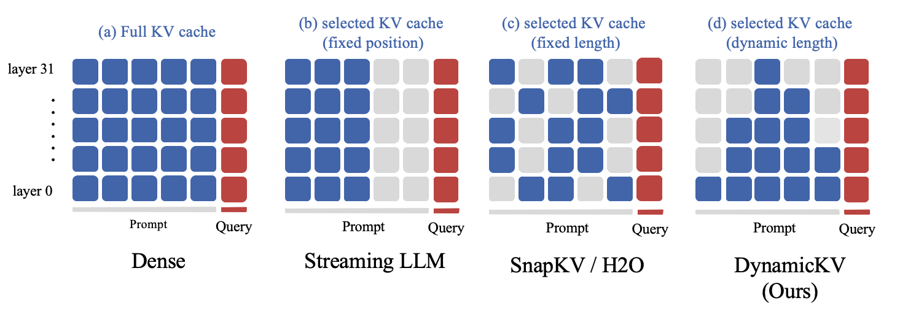

# Pyramid KV


Official repository for the paper "[PyramidKV: Dynamic KV Cache Compression based on Pyramidal Information Funneling](https://arxiv.org/pdf/2406.02069)".

<p align="center">
     <br>
</p>

## News

- [2024-06-10] Support PyramidKV, SnapKV, H2O and StreamingLLM at Flash Attention v2, Sdpa Attention now! If your devices (i.e., V100, 3090) does not support Flash Attention v2, you can set attn_implementation=sdpa to try PyramidKV at Sdpa Attention!

- [2024-06-10] Updated version of PyramidKV paper is available at [ARXIV](https://arxiv.org/pdf/2406.02069) with updated results of Needle in haystack for LlaMa-3-8B-Instruct and Mistral-7B-Instruct.

## TODO:

- [x] Support implementation of Streaming LLM, H2O and SnapKV

- [x] Support Mistral model

- [x] Support implementation of Needle

- [x] Support KV cache compression without Flash Attention v2 (i.e. Sdpa Attention) for V100

- [ ] Support Mixtral

- [ ] Support multi-GPU inference for 70B LlaMa-3

## Performence

<p align="center">
     <br>
</p>

<p align="center">
     <br>
</p>


## Visualization: Inefficient Attention 

The Llama model attention map with 3 documents is represented as follows:

<p align="center">
     <br>
</p>

we provide a notebook `visualization.ipynb` to reproduce the visualization result of each Llama-2-7b-hf model layer for a given 3 document.

Model attention maps for different layers would be stored at `./attention`


## Requirements

```python
transformers==4.40
flash-attn==2.4.0
```

##  Installation

```python

git clone https://github.com/Zefan-Cai/PyramidKV.git
cd PyramidKV
pip install -r requirements.txt .

```

## Inference


We support inference code on `LongBench` to repuduce our result.

Please refer to `scripts/scripts_longBench/eval.sh` to modify the parameters according to your requirements.

Our codebase support Flash Attention v2, Sdpa Attention, etc. The results presented in our paper in based on Flash Attention v2.

```bash
export CUDA_VISIBLE_DEVICES=0

model_path=""
method="PyramidKV" # Support "PyramidKV", "SnapKV", "StreamingLLM", "H2O".
attn_implementation="flash_attention_2" # Support "flash_attention_2", "sdpa", "".
max_capacity_prompts=512 # 128,2048 in paper
save_dir="results_long_bench" # path to result save_dir

python3 run_longbench.py \
    --method ${method} \
    --model_path ${model_path} \
    --attn_implementation ${attn_implementation} \
    --max_capacity_prompts ${max_capacity_prompts} \
    --save_dir ${save_dir} \
    --use_cache True

```

* CUDA_VISIBLE_DEVICES: LLaMA3 inference support on single GPU.
* model_path: Path to your model. Support "Llama-3-8B-Instruct" for now.
* method: Support `PyramidKV`, `SnapKV`, `StreamingLLM`, `H2O`.
* max_capacity_prompts: Selected KV Size in each layer. （e.g. 128, 2048 in paper）. When method is "PyramidKV", given that the total number of KV remains unchanged, the specific KV length for each layer will be modified accordingly
* save_dir: Path to your dir to save LongBench result.

After modifying parameters, run:

```bash 

sh scripts/scripts_longBench/eval.sh

```

## Needle in haystack

We support inference code on `Needle in haystack` to repuduce our result.

Please refer to `scripts/scripts_needle/eval.sh` to modify the parameters according to your requirements.

Our codebase support Flash Attention v2, Sdpa Attention, etc. The results presented in our paper in based on Flash Attention v2.

```

METHOD='pyramidkv'       # ['full', 'pyramidkv', 'snapkv', 'streamingllm', 'h2o']
MAX_CAPACITY_PROMPT=96  # [64, 96, 128, 256, 512, 1024, 2048, ...]
attn_implementation="flash_attention_2" # Support "flash_attention_2", "sdpa", "".
TAG=test


# For Llama3-8b

(
python -u run_needle_in_haystack.py --s_len 1000 --e_len 8001\
    --model_provider LLaMA3 \
    --model_name /mnt/workspace/zhiyuanhu/yuliang/models/llama3-8b_raw \
    --attn_implementation ${attn_implementation} \
    --step 100 \
    --method $METHOD \
    --max_capacity_prompt $MAX_CAPACITY_PROMPT \
    --model_version LlaMA3_${METHOD}_${MAX_CAPACITY_PROMPT}_${TAG}
) 2>&1  | tee results_needle/logs/LlaMA3_${METHOD}_${MAX_CAPACITY_PROMPT}_${TAG}.log

```

* Both LLaMA3 and Mistral2 inference support on single GPU.
* model_provider: LLaMA3 or Mistral2
* model_name: Path to your model. Support "Llama-3-8B-Instruct" "Mistral-7B-Instruct-v0.2" and for now.
* step: The increase of context length.
* method: Support `PyramidKV`, `SnapKV`, `StreamingLLM`, `H2O`.
* max_capacity_prompt: Selected KV Size in each layer. （e.g. 128, 2048 in paper）. When method is "PyramidKV", given that the total number of KV remains unchanged, the specific KV length for each layer will be modified accordingly


To reproduce our results, run

```
bash scripts/scripts_needle/eval.sh
```

After inference, run

`python scripts/scripts_needle/visualize.py` 

to draw the img, you should change `FOLDER_PATH` in `visualize.py` to your output path (the argument of `--model_version` in `eval.sh`).


## Citation

If you find **PyramidKV** useful for your research and applications, please kindly cite using this BibTeX:

```latex
@misc{cai2024pyramidkv,
      title={PyramidKV: Dynamic KV Cache Compression based on Pyramidal Information Funneling}, 
      author={Zefan Cai. and Yichi Zhang and Bofei Gao and Tianyu Liu and Keming Lu and Wayne Xiong and Yue Dong and Baobao Chang and Junjie Hu and Wen Xiao},
      year={2024},
      eprint={2406.02069},
      archivePrefix={arXiv},
      primaryClass={cs.CL}
}
```

## Acknowledgement


Thanks **[SnapKV]** [SnapKV: LLM Knows What You are Looking for Before Generation](https://github.com/FasterDecoding/SnapKV) for providing open-source code to support the expansion of this project.
